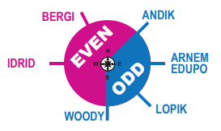

--8<-- "includes/abbreviations.md"

[Adapted From ZTL ARTCC Atlanta Pilot Guide](https://www.ztlartcc.org/pilots/guide/atl){target=new}

## General Information

- ICAO: KATL
- IATA: ATL
- Name: Hartsfield - Jackson Atlanta International Airport
- Location: Amsterdam, The Netherlands
- VATSIM: [https://www.ztlartcc.org/](https://www.ztlartcc.org/){target=new}

## Introduction

Amsterdam is a large metropolis. With hundreds of planes landing and taking off every day, its vital to be familiar with the airport. EHAM is a rather complex airport, which can make it difficult for pilots to navigate. We hope this guide makes it easier and more enjoyable for you to flying into and out of this airport.

## Departures

### Taxiing

### Push Back

### SIDs

Depending on your destination, you can expect to fly one of the following SIDs:

### Flight Level Rules

Unlike other parts of the world, EHAM makes use of your SID to determine your cruising flight level. You must have an **EVEN** flight level when assigned the **BERGI** or **IDRID** SID, and an **ODD** flight level when assigned any of the others. Below is a picture to demonstrate.

!!! note "Specific Flight Levels"
    When flying to a particular destination, you may expect to fly one of the following levels:

    - Flights to London airports: maximum FL240
    - Flight to (north)easter countries cannot use FL250
    - Flights to Paris airports: maximum FL290

### Departure Procedures

The transition *altitude* for IFR aircraft is 3000 ft, for VFR this is 3500 ft. The transition *level* is given in the ATIS.

After departure, you will climb to a maximum FL060 until issued furthen climb by ATC.

!!! warning ""
    After departure, you switch from the Tower frequency to the Approach/Departure frequency after passing 2000 ft. You should always contact Approach/Departures yourself unless Tower specifically tells you to "remain this frequency."

## Arrivals

There are three IAFs at EHAM. Namely, SUGOL, ARTIP, and RIVER. When passing any of these IAFs, you are met with a speed restriction of 250 kts. You must also fly 160 kts until passing 4 DME.

!!! note "ILS Frequencies"
    ILS runway 06 - 110.550  
    ILS runway 18C - 109.500  
    ILS runway 18R - 110.100  
    ILS runway 22 - 109.150  
    ILS runway 27 - 111.550  
    ILS runway 36C - 108.750  
    ILS runway 36R - 111.950  

!!! warning ""
    Just as when departing, when you arrive and have vacated the runway, you are expected to contact Ground yourself unless otherwise told.