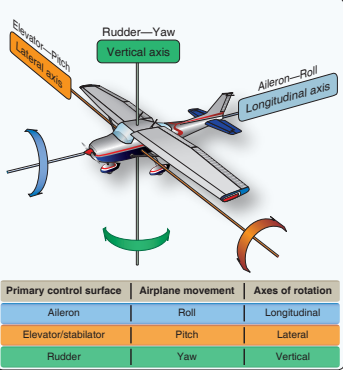
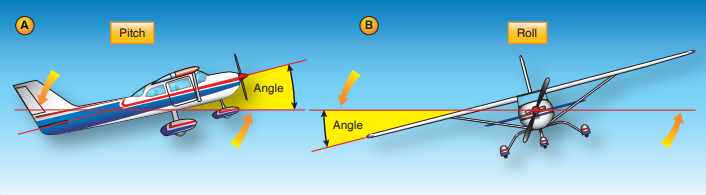
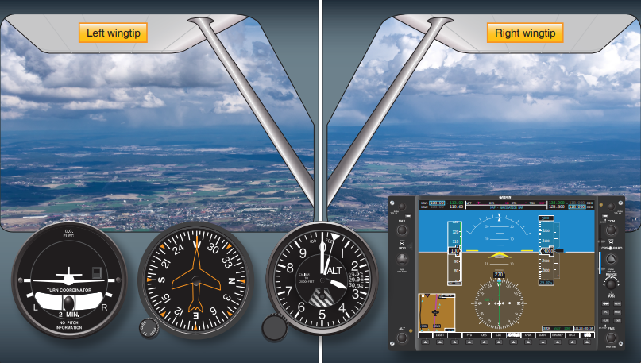

--8<-- "includes/abbreviations.md"

[Adapted from FAA-H-8083-3B Chapter 3](https://www.faa.gov/regulations_policies/handbooks_manuals/aviation/airplane_handbook/media/05_afh_ch3.pdf){target=new}

## Introduction

Airplanes operate in a different environment than a car, bike or just by walking. Drivers and bikers tend to focus on the forward motion and new pilots tend to do the same. However, an airplane operates in a 3-dimentional (3D) environment. Pilots need to be aware of horizontal, vertical, and lateral movement. The four fundamentals are the principle maneuvers that control an airplane during flight.

!!! note "The Four Fundamentals"
    The four fundamentals of flight are: straight-and-level flight, turns, climbs, and descents.

## Importance of The Four Fundamentals

To master any subject, you need to master the fundamentals first. Attempting to conduct advanced maneuvers before mastering the fundamentals, hinders the learning process. To be a competent pilot, you need to first master the basic fundamentals of airmanship.

!!! quote
    Consider the following: a takeoff is a combination of straight-and-level flight and a climb; turning on course to the first navigation fix after departure is a climb and a turn; and the landing at the destination is a combination of airplane ground handling, acceleration, pitch and a climb. 

As you progress to more difficult flight maneuvers, any deficiency in the mastery of the four fundamentals are likely to become barriers in your learning. Many new pilots notice difficulty in advanced maneuvers if they have a lack of understanding, training, or practice of the four fundaments. So, lets change that!

## Flight Controls

An airplane flies in a 3D environment, meaning, it can travel up, down, left, right, forwards, and backwards.

The forward movement of the elevator control will always move the plane in the same direction relative to the pilot's perspective. If the plane is right side up relative to the horrizon, pushing forward on the elevator control will cause the plane to descend. On the other hand, if the plane is upside down relevant to the horrizon, the same action will cause the plane to climb. Depending on the airplane's orientation to the earth, the same control actions can result in different reactions. That's why we came up will the following rule:

!!! warning "Important"
    The pilot is always considered the referenced center of effect as the flight controls are used.

{ align=left width="350"}

The following is always true regardless of the orientation to earth:

*With the pilot's hands:*

- Pulling the elevator pitch control toward the pilot (otherwise called back pressure) will cause the airplane's nose to rotate backwards around the pitch (lateral) axis of the airplane.
- Pushing the evelator pitch control away from the pilot (otherwise called forward pressure) will cause the airplane's nose to rotate forwards around the pitch axis of the airplane.
- Rotating the aileron control to the **right** will cause the airplane's **right** wing to bank (roll) lower.
- Rotating the aileron control to the **left** will cause the airplane's **left** wing to bank lower.

*With the pilots' feet:*

- Pushing the **right** rudder pedal away from the pilot (forward pressure) will cause the airplane's nose to move (yaw) to the **right**.
- Pushing the **left** rudder pedal away from the pilot (forward pressure) will cause the airplane's nose to yaw to the **left**.

## Attitude Flying

An airplane's attitude is determined by the angular difference between an airplane's axis and the natural horizon. A false horrizon can occur when the natural horizon is concealed or not apparent. This is important because it required the pilot to create a pictorial sense of the natural horizon.

!!! note
    - **Pitch Attitude:** The angle formed between the airplane's lpngitudinal axis and the natural horizon. (A)
    - **Bank Attitude:** The angle formed by the airplane's lateral axis and the natural horizon. (B)
    - **Yaw Attitude:** The angle formed by the airplane's vertical axis and the direction or flight; not relative to the natural horizon.

<figure markdown> 
  
  <figcaption style="font-size: 12px;">(A) Pitch attitude is the angle formed between the airplane’s longitudinal axis. (B) Bank attitude is the angle formed by the airplane’s lateral axis.</figcaption>
</figure>

Controlling an airplane requires one of two methods to determine the airplane's attitude in reference to the horizon.

### Flying in VMC

When flying in VMC, a pilot uses their eyes and visually references the aircraft's wings and cowling to determine the airplane's attitude to the horizon.

### Flying in IMC

When flying in IMC, the natural horizon is obscured and thus a pilot cannot visually reference it. That's why, in IMC, the pilot uses the airplane's machanical or electronic instruments to determine the airplane's attitude to the natural horizon.

### Controlling an Airplane's Attitude

Airplane attitude control is composed of four components:

- **Pitch Control:** Using the elevator to raise and lower the airplane's nose.
- **Bank Control:** Using the ailerons to reach a desired bank angle.
- **Power Control:** Using the throttle to control the thrust and airspeed to meet a specific objective.
- **Trim Control:** Used to relieve the control pressures held by the pilot on the flight controls after a desired pitch attitude has been attained.

## Straight-and-Level Flight

!!! note "Straight-and-Level Flight, What is it?"
    Straight-and-Level Flight is flight in which heading and altitude are constantly maintained.

The Four Fundamentals are in essence a spin of straight-and-level flight. Therefore, the importance of this concept can not be understated. Straight-and-level flight is essentially a matter of fixing the relationship of a reference point on the aircraft to the natural horizon. Since the refernce points depend on the pilot's seating position, height, and the way they sit, it's important that your reference points are established on the ground.

!!! tip
    Vertical reference lines are best establsihed on the ground, such as when the aircraft is placed on the centerline of a runway.

    Horizontal reference lines are best establsihed during flight, such as during cruise.

    The horizon reference point will always remain the same, since that point is always on the horizon.

### Straight Flight

Maintining a constant direction or heading is accomplished by keeping both wings level. Both wingtips should be equal above or below the natural horizon. Any correction should be made with coordinated use of the ailerons and rudder.

<figure markdown> 
  
  <figcaption style="font-size: 12px;">Wingtip reference for straight-and-level flight.</figcaption>
</figure>

Straight-and-level flight does not require application of flight controls if the air is smooth and the aircraft is properly trimmed. If corrections are necessary, the pilot may make the correction precisely, smoothly, and accurately.

!!! warning
    Pilots may tend to look out to one side continually, generally to the left due to the pilot’s left seat position and consequently focus attention in that direction. This not only gives a restricted angle from which the pilot is to observe but also causes the pilot to exert unconscious pressure on the flight controls in that direction.

It is important to continually scan around you to ensure the aircraft's attitude is correct, but also to ensure other factors are on par for a safe flight. Continually checking bot wingtips has multiple advantages: it's the only positive check for level flight, it allows you to look for traffic, terrain, significant weather, and maintaining situational awareness.

### Level Flight

Maintaining level flight is a fairly simple skill. In learning this, it's important that the pilot should only exert enough pressure on the flight controls to produce the desired result. The pilot should learn to associate movements of references with control pressures which produce attitude movement. Subsequently, the pilot can develop an ability to adjust the airplane's attitude without having to excessively rely on instruments or outside references. During straight-and-level flight, the airspeed should remain the same if the power setting is also constant. 

!!! tip "Maintaining Level Flight"
    Level flight involves having the pilot properly seated, selecting a reference point infront of you, and then keeping that reference point in a fixed position relative to the natural horizon.

A common error new pilots make is attempting to hold the wings level by only referencing the aircraft's nose. Due to the nose's short horizontal reference line, slight deviations could go unnoticed. As such, the wingtips should be the primary reference when maintaining straight-and-level flight.

## Level Turns