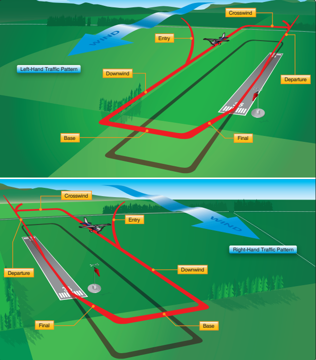
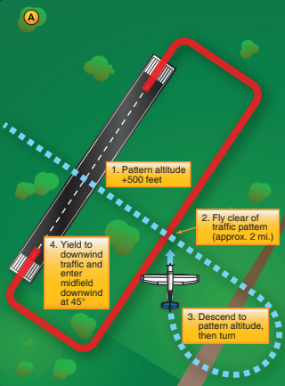
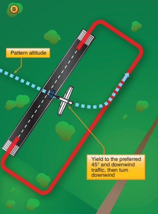

--8<-- "includes/abbreviations.md"

Adapted from FAA-H-8083-3B Chapter 7

## What is a pattern?

Otherwise referred to as ‘Traffic Pattern’ or ‘Circuit’ in other parts of the world, a pattern is an effective and common way to practice all stages of a flight. From takeoff to landing, a traffic pattern will help you strengthen your stills as a pilot.

!!! note ""

    ### Direction of a Pattern

    Usually, the pattern will be to the left. Unless it is clearly communicated by airport markings or ATC (if applicable), the direction will be to the left.

    ### Altitude of a Pattern

    The altitude of a traffic pattern is usually 1000 feet above airport elevation. For example, if the elevation is 486 feet, the pattern altitude will be at 1486 feet. The pattern altitude may differ depending on the weight of the aircraft

    ### Speed when flying a Pattern

    When operating at a non-towered aerodrome, 200 knots is the speed limit. In any case, you should adjust your airspeed to maintain appropriate separation from other traffic

## Weather Considerations

As the PIC it is your responsibility to determine that weather conditions are safe for the airport you are conducting patterns at. Be sure to check local METARs and TAFs to make sure that you are in VMC and your aircraft’s crosswind limit is not exceeded (if applicable).

!!! warning

    Most mid-air collisions occur on clear days with unlimited visibility. Never assume you have all the traffic in sight. Always keep scanning for new or oncoming traffic.

!!! note "Traffic Levels"

    On VATSIM, people will often pick busier, larger airports to practice their patterns. This is because it is more likely that ATC will be online. As part of planning a traffic pattern, check a VATSIM map such as vatSpy to make sure traffic levels are low enough to conduct patterns

## Stages of a Pattern

Traffic patterns have five different legs/stages. These are defined as upwind/departure, crosswind, downwind, base and final.

!!! info "Stages"
    
    ### Upwind Leg

    **The upwind leg is flown at controlled airports and after go-arounds.**

    When necessary, the upwind leg is part of the traffic pattern in which the aircraft goes from final approach to the climb altitude to initiate a go-around. When at a safe altitude, the pilot will make a shallow bank turn to the upwind side of the airport; this allows for better visibility of the runway for departing aircraft. 

    ### Departure Leg

    **The departure leg is starts when the aircraft leaves the ground and ends when the pilot commences a 90° turn to the crosswind leg.**

    The departure leg is flown straight after takeoff, starting from when the aircraft leaves the ground until the pilot commences a 90° turn to the crosswind leg.
    On the departure leg, the pilot should continue a steady climb. If remaining in the pattern, when within 300 feet of the pattern altitude, commence a turn to the crosswind leg of the pattern. If departing the pattern, the pilot will continue straight or make a 45° turn to the left of right (depending on the pattern direction) after reaching the pattern altitude.

    ### Crosswind Leg

    **The crosswind leg is horizontally perpendicular to the extended centerline of the active runway.**

    The crosswind leg is horizontally perpendicular to the extended centerline of the takeoff runway. The pilot enters a crosswind leg by making a 90° turn from the upwind leg. The pilot should continue on the crosswind leg to the downwind leg position.
    Since the takeoff was most likely made into the wind, the wind will now be approximately perpendicular to the aircraft. The pilot may make slight turns into the wind to remain on a ground track that is horizontally perpendicular to the extended centerline of the runway.

    ### Downwind Leg

    **The downwind leg is a leg parallel but in the opposite direction of the active runway.**

    The downwind leg is flown parallel but in a opposite direction to the active runway. The leg is flown at about ½ to 1 mile out from the landing runway. During the leg, pilots should complete all pre-landing checks, including deploying landing gear if applicable.
    Pattern altitude is maintained until at least the approach end of the landing runway. The pilot should continue the downwind leg until a point about 45° from the approach end of the runway. Then the pilot, will make a medium bank turn to the base leg of the pattern.

    ### Base Leg

    **The base leg is a transitional leg from downwind to the final approach leg.**

    The base leg is opposite the crosswind leg and is the transitional leg from downwind to final. The pilot should pay close attention to the wind to make sure there is sufficient distance from the approach end. This ensures a calm, gradual descent to the touchdown point. The ground track of the aircraft is perpendicular to the extended centerline of the landing runway. As with the crosswind leg, the pilot may make adjustments to the head of the aircraft so as to not drift from the intended flight path.
    Before turning onto final, the pilot must ensure there is no danger of colliding with another aircraft already on final approach. Do not attempt a steep turn onto the final approach leg. Remember: If in doubt, go around.

    ### Final Leg

    **The final leg is a leg along the extended centerline of the runway with a descending flightpath to touchdown.**

    Otherwise referred to as “final,” the final approach leg starts on the completion of the base-to-final turn and ends when the aircraft has touched down. Often referred to as the most important part of the pattern, the final approach leg requires careful precision and sound judgement from the pilot to accurately control airspeed and descent angle.
    When on final approach, you have the right-of-way over other aircraft. When multiple aircraft are on final, the aircraft with the lowest altitude has the right-of way. (14 CFR Part 91)

## Entering the Pattern

When arriving, the pilot should be aware of circuit direction, altitude and traffic, among others. Additionally, the pilot should remain clear of other traffic until established on the entry leg. The entry leg is often flown at a 45° angle to the downwind leg, heading towards a point abeam the midpoint of the landing runway. Descending while entering the pattern creates a serious collision hazard.

The pilot should ensure the length of the entry leg is sufficient to provide a clear view of the entire pattern and to allow for adequate planning for the arrival.

### Alternative Methods of Entry

!!! tip ""
    **You can also enter the pattern by overflying the field first.**

    When overflying the airfield, it is best to stay at about 500 feet above the pattern altitude. If large turbine aircraft operate at your airfield, fly at a pattern altitude of 2000 feet above ground level to ensure separation from them.

A - Preferred Entry, B - Alternate Entry